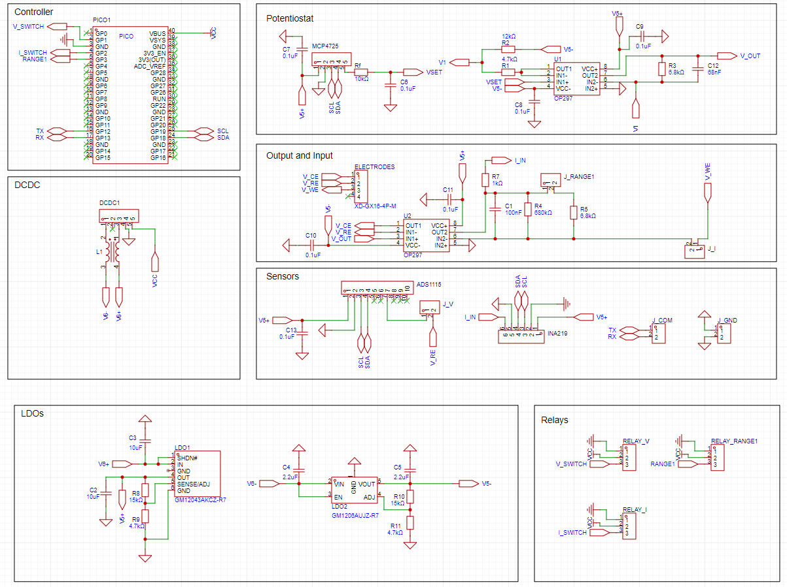
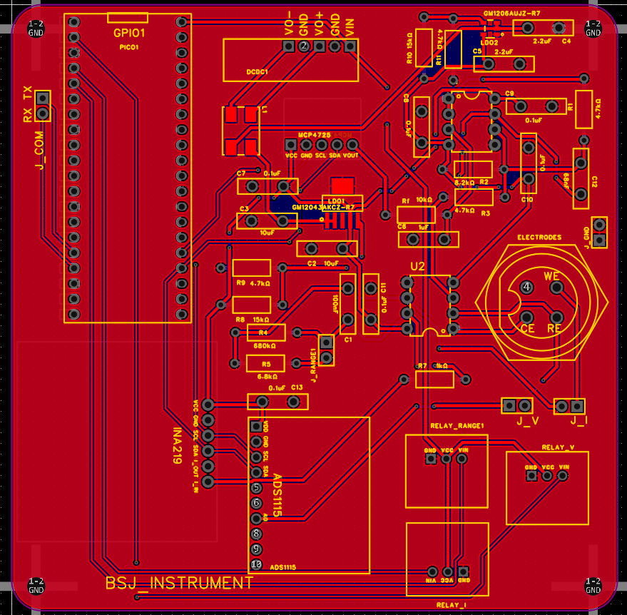
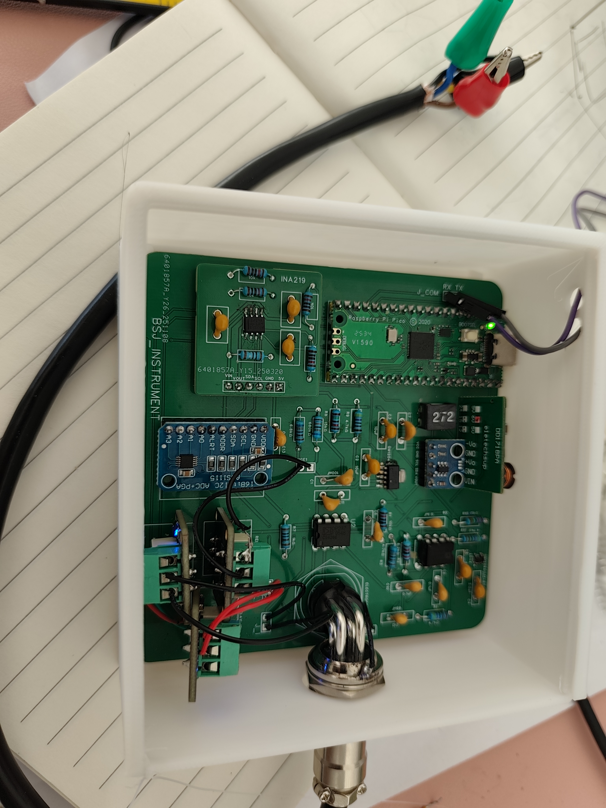
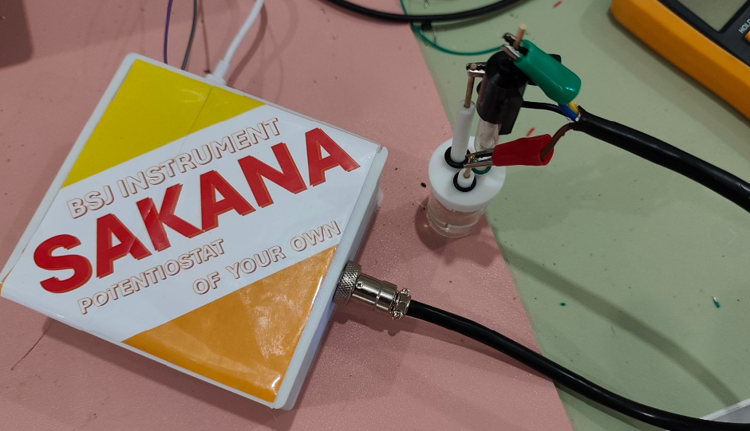
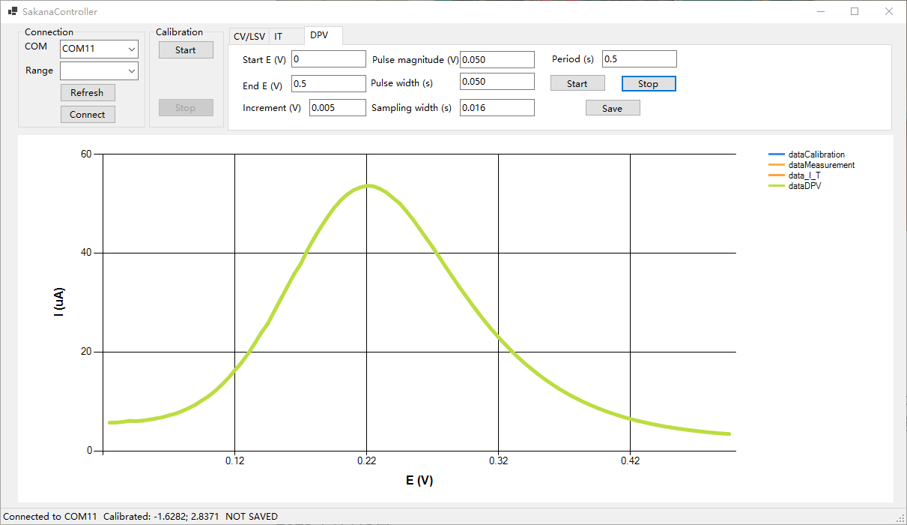

[中文](#cn) | [English](#en)

# SAKANA：年轻人第一台循环伏安的全面制造指南

SAKANA是一款基于树莓派Pico的电化学工作站，其中包含了所有软硬件信息。这篇介绍将从第一视角呈现SAKANA的开发和探索过程，以便读者透彻了解仪器的设计思想。

目录结构：

- **Hardware**
  
  Gerber_SAKANA_PCB.zip： PCB制板文件
  
  SAKANA_PCB.epro：PCB设计文件（基于立创EDA）
  
  Shell.zip：外壳模型，可进行3D打印

- **Sources**
  
  main.py：Pico上的Micropython文件

- **sources_SakanaController**
  
  上位机控制软件源代码，Releases中有编译后的可执行文件

鉴于绝大多数化学工作者都像我一样，没有接受过系统的电子工程教育，本文中会详细介绍电路的设计过程。如果你有此类基础，可直接跳转到**6. 建立连接**。

**1. 背景介绍**

   现代电化学工作站基于运算放大器（简称运放）进行设计，主要在20世纪70年代发展起来。早年文献中对电化学工作站的设计原则、特别是电路稳定性问题进行了诸多讨论，这些讨论对电路知识有较高的要求，有兴趣的读者可以自行查阅。近十多年来，得益于单片机技术的普及，使用以Arduino为代表的单片机控制从而低成本制造电化学工作站的案例不断见诸报道，以至于到了相当丰富的程度。甚至已经有学校将自制电化学工作站纳入了分析化学实验课程中（https://www.chem.uci.edu/~unicorn/243/labs/W2019Chem243Lab3.pdf）。

   

   本文的设计原型来自2016年Meloni的工作（J. Chem. Educ. 2016, 93, 7, 1320–1322）。Meloni报道了基于Arduino的电化学工作站设计，并给出了电路图和简易源代码。然而不幸的是，虽然Meloni文中呈现了良好的结果，但如果直接照搬它的设计，仔细考察，就会发现其实并不能用。接下来我们会展示这一电路的原理、以及本文的装置的设计和改进过程。

**2. Meloni原型机的原理**

   用于循环伏安的电化学工作站基于三电极系统。对三电极系统的理解是仪器分析课程的基本内容，本文不再赘述。一个合格的电化学工作站需要确保以下几点：

   a. 在参比电极(RE)上没有电流流过；

   b. 能精确控制工作电极（WE）相对于RE的电位，并且这一电位需要以最高几个Hz的频率变化；

   c. 能精确测量通过WE的电流，电流的量级在零点几到几百uA之间。

   

a. 电压控制电路  

运放是现代电化学工作站的核心，要理解电压控制电路必须首先理解运放。

一个运放至少有5个引脚：2个电源引脚（图中正负6.5 V），一个同相输入端（图中+），一个反相输入端（图中-），一个输出端。当输出端与反相输入端通过电阻连接时，构成了负反馈电路；对于理想运放，输入端可视为无穷大的电阻，而一旦构成负反馈，则两个输入端电位相等且都没有电流流过。因此对于上图中左侧的运放，输出电压Vin始终等于同相输入端电位，这被称为跟随器，可对电路起到隔离作用。接下来为了解出第二个运放的输出电位Vo，可设通过R4的电流为i，则Vo = -iR4，可知运放对电流有放大作用，放大倍数取决于反馈电阻。由于通过反相输入端的电流为0，可知i = Vin / R2 - 5 V / R2，进而可求出Vo。通过控制Vin = V1，即可控制Vo；随后Vo接到UA3上，只要RE和CE放在电解池中，就再次构成负反馈，RE上的电压即等于V1。  

之所以要采用这样的设计，是由于多数单片机只能输出正电压，因此需要通过R3施加一个负电压偏置来将其转换为循环伏安所需要的电压范围。在Meloni原型机中，V1通过Arduino的PWM供给。PWM是通过让输出信号在0 V和（对于Arduino来说）5 V间快速切换产生方波的技术，假设占空比为a，则等效输出5 V * a的电压。为了将这种方波信号转换为循环伏安所需要的直流信号，Meloni原型机在R1和UA1之间对地接入电容C1，从而构成了RC滤波电路。RC滤波电路对电信号的阻抗随频率上升而快速增加，对于频率大于1/(2pi*RC)的信号，通过RC滤波器后衰减大于3 dB，这被称为截止频率。方波信号经过傅里叶展开后，可视为直流信号叠加一系列高频信号；理想上，当高频信号被充分滤除，就可以得到5 V * a的直流电压。随后经过UA1~UA3，最终反映到RE对地的电位上。

类似地，UA2上的C2同样与R4构成RC滤波器，从而尽可能滤除运放带来的噪声。

b. 电流采样电路

Meloni原型机中，电流采样电路接在CE上，通过R5施加5 V的偏置，接到运放上，通过R6负反馈，使得CE的电位恒为0。两者混合后的电流i被放大为电位iR6（恒为正，同样是由于单片机只能读取正电位），经过一个跟随器后进入Arduino的ADC引脚（Analog to Digital）从而被读取。读完上文后，相信读者已经会计算通过CE的电流与ADC读数的关系了。

你发现了什么不对了吗？

在Meloni原型机中，CE和WE的位置画反了。我们并不关心CE上的电位是多少，而必须控制WE和RE的电位差，因此必须将WE接在电流采集电路处，从而使得上面控制的RE相对于地的电位等同于WE相对于RE的电位的负值。  

总之，现在你已经理解了Meloni原型机的原理，接下来就开始实现吧。

**3. 材料清单**

- 1 * 树莓派Pico

- 1 * MCP4725模块

- 1 * ADS1115模块

- 1 * INA219芯片

- 1 * 6 V输出DC/DC升压模块

- 2 * OP297运放

- 4 * 继电器模块

- 1 * CH340串口模块

- 若干电容电阻
  
  总成本在100元左右。
  
  | 名称               | 数量              | 链接                                                 | 备注      |
  | ---------------- | --------------- | -------------------------------------------------- | ------- |
  | 树莓派Pico          | 1               |                                                    |         |
  | MCP4725模块        | 1               | https://item.taobao.com/item.htm?&id=549632416001  |         |
  | ADS1115模块        | 1               | https://item.taobao.com/item.htm?&id=631122402654  |         |
  | INA219芯片         | 1               | https://item.taobao.com/item.htm?id=725297963549   |         |
  | 6 V输出DC/DC升压模块   | 1               | https://item.taobao.com/item.htm?id=666072862041   |         |
  | OP297运放          | 2               | https://item.taobao.com/item.htm?id=599390292581   |         |
  | 继电器模块            | 4（v1.0）或3（v2.0） | https://item.taobao.com/item.htm?&id=628701168992  |         |
  | CH340串口模块        | 1               | https://detail.tmall.com/item.htm?id=41323941056   |         |
  | GM12043AKCZ-R7   | 1               | https://item.szlcsc.com/8421183.html               | 仅v2.0需要 |
  | GM1206AUJZ-R7    | 1               | https://item.szlcsc.com/50919536.html              | 仅v2.0需要 |
  | 共模扼流圈ACM9070-272 | 1               | https://item.taobao.com/item.htm?id=711722477029   | 仅v2.0需要 |
  | 电容：10 uF         | 2               |                                                    |         |
  | 电容：2.2 uF        | 2               |                                                    | 仅v2.0需要 |
  | 电容：0.1 uF        | 10              |                                                    |         |
  | 电容：1 uF          | 3               |                                                    |         |
  | 电容：68 nF         | 1               |                                                    |         |
  | 电阻：4k7           | 4               |                                                    |         |
  | 电阻：10k           | 5               |                                                    |         |
  | 电阻：6k8           | 2               |                                                    |         |
  | 电阻：68k           | 1               |                                                    | 仅v1.0需要 |
  | 电阻：680k          | 1               |                                                    |         |
  | 电阻：1k            | 1               |                                                    |         |
  | 电阻：15k           | 2               |                                                    | 仅v2.0需要 |
  | GX16航空插座弯头       | 1               | https://item.taobao.com/item.htm?id=890416759846   | 仅v2.0需要 |
  | 屏蔽线母头GX16-4芯     | 1               | https://detail.tmall.com/item.htm?&id=691474825406 | 仅v2.0需要 |
  
  
  
  （没有任何淘宝店铺赞助本文）

Meloni使用了Arduino，而本文使用树莓派Pico。Pico的性能更为优异，而价格却更加低廉。值得注意的是Pico的输出电压是3.3 V（另有一个5 V引脚），因此基于输出5 V的Arduino的电路中元件取值要重新换算。  

**4. Meloni原型机的实现和失败，与第一版可工作的电路**  

Meloni已经给出了完整的电路图，将其实现是十分简单的事情，不再赘述。唯一值得一提的是，电路中需要使用负电压，仅使用Pico无法做到，本文中使用了升压电源模块得到正负6 V。正电压非常标准，而负电压实际大约为-5.5 V。它同样用于给运放供电。绝大多数运放的输出电压都位于两个电源引脚的电压之间，通常是一个较窄的范围（这将成为日后电阻选值的考量），选择轨到轨运放可以输出到接近供电电压的范围。

然而很快就会发现，这套电路的立足之本，即通过对PWM滤波以控制RE上的电位的做法完全不可行。一方面，即使经过滤波，电压仍然会不可避免地波动（纹波现象），而另一方面的问题则更加严重：

上图展示了PWM占空比与经过滤波得到的电压的关系。理想情况下，电压应随占空比呈现线性，但事实完全不同，呈现出一条十分不规则的曲线。这种情况下，通过PWM控制RE上的电压完全不可靠！  

幸运的是，由于现代电子工业高度发达，许多电路中的功能可以方便地找到模块，像搭积木一样处理。事实上，如果想输出可调的电压，并不需要手动设计电源电路，使用（3）中展示的MCP4725模块即可。它基于I2C协议和Pico连接，可以方便地使用Github上现成的库进行控制。经过实测，它可以精确、稳定地输出0 ~ 4.5 V的直流电压。

使用MCP4725后，采用了如上电路以适配Pico的性能。在面包板上搭建好后，已经可以用于测定盐水中的赤血盐的CV：  

**5. 进一步改进：重做电流采样**  

上述电路如果作为教学实验，则已经可以了；但如果要用于实际测量，还存在诸多问题。其中最大的问题在于噪声。事实上，Pico ADC的噪声是一个世界性难题，许多人都受此困扰而难以找到解决方案。以下随机展示一个ADC面对直流电的测量结果，可见存在相当程度的不规则的跳变。这一噪声完全来自Pico自身的缺陷，无法被任何外部电路滤除。  

尽管Pico手册上给出了改进ADC的建议，但最终它们没能起效，因此接下来需要放弃Pico自带的ADC，采用其他模块。在这里，需要用到两个模块：ADS1115电压采集模块，以及INA219电流采集模块。两者都使用I2C协议，和MCP4725共用2根线进行通信。

事实证明，ADS1115的精度良好，可以非常平稳地测定接入的电压，并且可以测定不低于-0.5 V的负压。但问题在于采样频率，ADS1115每秒只能进行860次采样，无法满足CV测试在很短的时间内连续变化电压并进行采样的需求，如果硬上会造成死机。但它可以用于电路的校准：  

将RE和CE的接线端连起来（必须这样做，否则无法构成负反馈），用ADS1115测量RE处的电压，即可对仪器进行校准。  

注意当电压小于-0.5 V时，ADS1115不再能正常工作，而且不仅自己不干活，还会干扰别人，导致RE上的电压异常，因此ADS1115只能用于校准，CV测量时必须同RE断开。

而接下来的INA219将成为电流采样的核心。它与ADC的思路不同，是直接测量电流。INA219本身是个集成电路，需要搭配外围电路使用，商业可得的INA219模块已经集成了一个0.1 Ohm的采样电阻，它通过测定采样电阻上的电压来给出电流，支持正负电流。量程可调，最小量程为400 mA，分辨率为12位，即400/(2^12)~0.1 mA。  

INA219的引入可以使得我们直接去掉电流采样电路冗杂的偏置电压设计，只要将流过WE的电流放大到合适的范围，让INA219采样即可。利用这种思路，在简单尝试后得到了十分积极的初步结果。其中黑线为原始信号，红线为经过平滑后的结果。

以下为SAKANA v1.0使用的电路：

在这一电路中，流过WE的电流i经过一个跨阻放大器，转化为iR的电压信号，其中R可在R4到R6之间选择。经过R7后，通过INA219的实际电流为iR/R7，测量这一电流信号即可换算为流过RE的电流。为了确保INA219的测量精度，iR/R7不能太小，需要在几个mA量级；同时iR又不能太大，必须落在运放能够可靠工作的电压范围内。由于CV波的电流从零点几到几百uA，跨越了3个数量级，采用两个继电器控制接入从6.8 k到680 k之间的电阻以改变量程。

OpAmp2和OpmAmp4的反馈回路上都并联有电容，起到增加运放稳定性和减少输出噪波的作用。借助示波器，可以清晰地看到C1对于确保RE上电压的稳定性有至关重要的作用。没有C1时，RE上的电压会以几百mV的幅度波动：

C2同样可以显著抑制噪声。此处经过大量尝试，确定C2取值为100 nF，且不随接入的电阻而变化。较大的C2虽然可以进一步使得输出信号变得平滑，但由于滤除了太多快速变化的信号，导致波形畸变、以及更严重的是当改变设定的输出电压时需要相当长的时间才能达到稳定。

R7是一个1 kOhm的电阻。在设计初期，在R7处曾经使用过更小的电阻，寄希望于它能够使得流过INA219的电流尽可能大，以降低测定误差的影响。但不幸的是，较小的R7会导致测定曲线出现未曾预料的巨幅波动。以下是R7 = 100 Ohm的典型图形：

经过大量尝试，确定R7为1 kOhm时，不会出现振荡现象。为了提高INA219的测量精度并与当前电阻的取值匹配，需要将它并联的采样电阻从0.1 Ohm改成10 Ohm。为了实现这一改动，既可以买来商品INA219模块，手动取下采样电阻后更换：

也可以重新做一个自己的PCB，相关设计文件在Hardware里：

**6. 建立连接**

在面包板上，将Pico与各模块连接，采用如下接线图（只标出模块之间的连接）：

其余部分连接可参照如下原理图：

在这里使用了4个继电器，其中2个用于控制量程，1个用于控制ADS1115只在希望进行电压校准时接到RE上（进行CV测定时必须断开，否则RE在负电压时不对），1个用于控制电流采集电路（只在进行CV测定时接上，否则电解池会被持续电解）。采用一个CH340串口模块实现与计算机的通信。连接完成后效果如下，可以使用配套软件非常方便地调试。

**7. 配套软件**

SakanaController是针对Sakana的控制程序。在使用时，首先在Connection区域找到正确的串口并连接，然后在Calibration区域点击Start进行校准。正常情况下，应是一条斜向下的直线（第一个点处存在跳变，属于正常，不会带来任何影响）。此处的横坐标是MCP4725的输出电压，纵坐标为RE的电压，两者线性度非常好，可以在任何时候点击stop提前停止校准。校准完成后，将得到MCP4725电压与V_RE的相关系数，用于后续CV测试。

在完成校准后，在Measurement区域设置测试参数，点击Start，测试就会开始，曲线实时更新。以下为部分结果案例。

*KCl中的黄血盐*

*DCM中的二茂铁*

测试完成后，点击Save，可以保存到纯文本文件。

1. 除了CV测量外，软件还有恒电位仪模式。完成校准后，在Potentiostat处输入期望的电压，点击Start，仪器就会让WE相对于RE的电位等于设置数值，可用于电解实验。对于焊接到PCB上的仪器，**电压范围可达正负2.5 V，误差在30 mV以内（典型值10 mV）**。

**8. 转移到PCB**  

在面包板上建立的电路虽然方便调试，但接触不良的现象非常严重，只要轻微触碰，仪器的表现就会改变，而焊接到PCB板上后就将得到非常可靠的成品。  

绘制好原理图和PCB后，进行生产、焊接即可。

至此，一个用于循环伏安的电化学工作站的v1.0版本就完成了。

SAKANA v1.0非常便于零基础人士制作，但有一个缺陷：所有的模拟供电都直接通过Pico或DCDC开关电源进行，这会带来非常严重的供电噪声。由于RE电压通过MCP4725输出与-6 V 开电源输出组合得到，这会直接在RE/WE直接引入100 mV左右的噪声，同时还叠加50 Hz工频干扰。这种噪声会导致电解池中很大的充放电电流，并且可能干扰测量得到的电化学行为。为此，我们需要进一步改进。

**9. SAKANA v2.0：进一步改善降低噪声**

为了进一步改善噪声问题，可以使用两个低噪声LDO，将LDO的稳压输出用于后续所有模拟电路的供电。来自共模半导体的GM1204和GM1206价格低廉，且可以在高达MHz的频率下保持极高的纹波抑制。在SAKANA v2.0中，来自DCDC的输出首先经过共模扼流圈L1，然后分别输入到两个LDO中，将+6/-6 V转换为+5/-5 V，用于运放、MCP4725、INA219、ADS1115的供电，并使用-5 V稳压输出与MCP4725输出一起形成RE的最终电位。

此外，由于在CV测试中，MCP4725实际输出的是台阶信号，在输出后加了一级RC滤波，使用Rf（10 kOhm）和C6（0.1 uF）构成时间常数约为1 ms的滤波器，一定程度上让台阶信号平滑化并减少过冲的影响。需要小心的是，此处滤波的时间常数不能太大：虽然CV需要尽可能平滑的三角波，但DPV则需要持续时间在几十个ms的尖锐脉冲信号。因此此处的取值需要权衡CV和DPV的需要。使用这一版电路，用示波器在PCB的RE接线口与GND处测量，噪声可以缩减到5 mV左右。

由于这两个LDO的封装很小，在焊接时需要格外小心，且需要使用热风枪。

另一个重要的噪声源是伸出PCB的导线从环境中拾取的电磁波干扰，其中又以RE到电极的连接线最为重要。事实上，如果使用示波器对输出波形进行测量，就会很明显地感觉到环境干扰的重要影响：如果使用接线弹簧，噪声只有5 mV左右；而如果使用鳄鱼夹连接PCB与示波器，噪声会飙升到20 mV以上。这是由于任何导线环路在空气中都会时刻拾取空中的电磁波干扰。因此，即使RE/WE的电位在PCB上是准确且稳定的，一旦用普通导线接外界电解池，也会引入额外的噪声。为此，将原先使用3根导线连接电极的方法改成使用航空插头+屏蔽线；屏蔽线采用容易购得的4芯屏蔽线，只使用其中3根线，外层铜皮屏蔽层与金属航空插头连接，再在航空插头母座上用导线接地。屏蔽线另一端，手动焊上3个鳄鱼夹连接电极，要让暴露在屏蔽线外的导线尽可能短。使用这一方法，可以将最终输出的RE/GND电位噪声控制在10 mV以内。

在测试时需要注意，不能将示波器直接连接在RE/WE两端，否则会极大改变输出波形，导致剧烈震荡。为了测量这两者的电位，需要测的是RE/GND电位，也就是示波器一头接RE，另一头接PCB上的某个接地点。

此外，为了适配±5 V的供电，重新设计了各电阻的数值，使得支持的电位范围达到±2.8 V. 用于控制量程的继电器缩减到1个，分别对应百uA/1 uA级别的电流。

以下是SAKANA v2.0的实物照片。下位机固件使用v2.0版本，上位机控制软件完全相同。

借助SAKANA Controller，可以测定CV、LSV、IT、DPV。以下是KCl水溶液中赤血盐的DPV测定示例：

**关于**

这个项目的名称是SAKANA，发音与Cyclic相似。

非常鼓励读者将本文所介绍的内容用于自己的教学和研究中。凡引用本文者，必须标明出处。**凡进行发表、或基于本项目进行二次开发者，必须引用Github页面。禁止用于未经作者同意的商业用途。**

*BSJ INSTRUMENT 泊州仪器*

2025年1月15日

本项目使用了如下Github仓库中的成果：

[chrisb2/pyb_ina219: This library for MicroPython makes it easy to leverage the complex functionality of the Texas Instruments INA219 sensor to measure voltage, current and power.](https://github.com/chrisb2/pyb_ina219)

[robert-hh/ads1x15: Micropython driver for ADS1115 and ADS1015](https://github.com/robert-hh/ads1x15)

---

# SAKANA: The First Comprehensive Guide to Building a Cyclic Voltammetry Instrument

This is an electrochemical workstation (potentiostat) based on the Raspberry Pi Pico, containing all hardware and software information. This introduction presents the development and exploration process of SAKANA from a first-person perspective, allowing readers to thoroughly understand the design philosophy of the instrument.

### Directory Structure

- **Hardware**
  
  - `Gerber_SAKANA_PCB.zip`: PCB fabrication files (Gerber).
  - `SAKANA_PCB.epro`: PCB design file (based on EasyEDA).
  - `Shell.zip`: Shell model, ready for 3D printing.

- **Sources**
  
  - `main.py`: Micropython file for the Pico.

- **sources_SakanaController**
  
  - Source code for the PC host software. Compiled executables can be found in Releases.

---

Given that most chemists, like me, have not received systematic education in electronic engineering, this article will detail the circuit design process. If you already have this background, you can skip directly to **6. Connection**.

**1. Background**

Modern electrochemical workstations are designed based on operational amplifiers (Op-Amps) and were primarily developed in the 1970s. Early literature discussed the design principles of potentiostats, especially circuit stability issues, extensively. These discussions require a high level of circuit knowledge, and interested readers can look them up. Over the past decade, thanks to the popularity of microcontroller technology, low-cost potentiostats controlled by microcontrollers like Arduino have been reported frequently. It has become so common that some schools have even incorporated DIY potentiostats into their analytical chemistry laboratory courses (https://www.chem.uci.edu/~unicorn/243/labs/W2019Chem243Lab3.pdf).

The design prototype of this project comes from Meloni's work in 2016 (*J. Chem. Educ.* 2016, 93, 7, 1320–1322). Meloni reported an Arduino-based potentiostat design and provided circuit diagrams and simple source code. Unfortunately, although Meloni presented good results in the paper, a careful examination reveals that simply copying the design does not work. Next, we will demonstrate the principles of that circuit, as well as the design and improvement process of the device presented here.

**2. Principle of the Meloni Prototype**

Electrochemical workstations used for cyclic voltammetry (CV) are based on a three-electrode system. Understanding the three-electrode system is basic content in instrumental analysis courses, so it will not be repeated here. A qualified potentiostat needs to ensure the following:

a. No current flows through the Reference Electrode (RE).

b. It can precisely control the potential of the Working Electrode (WE) relative to the RE, and this potential needs to change at a frequency of up to several Hz.

c. It can precisely measure the current passing through the WE, with magnitudes ranging from fractions of a microampere to several hundred microamperes.

**a. Voltage Control Circuit**

The Op-Amp is the core of modern electrochemical workstations. To understand the voltage control circuit, one must first understand the Op-Amp.

An Op-Amp has at least 5 pins: 2 power pins (+/- 6.5 V in the figure), a non-inverting input (+), an inverting input (-), and an output. When the output is connected to the inverting input via a resistor, a negative feedback circuit is formed. For an ideal Op-Amp, the input terminals have infinite resistance. Once negative feedback is established, the potentials of the two input terminals are equal, and no current flows through them. Therefore, for the Op-Amp on the left in the figure above, the output voltage Vin always equals the non-inverting input potential. This is called a voltage follower and provides circuit isolation. 

To solve for the output potential Vo of the second Op-Amp, let the current through R4 be *i*. Then Vo = -iR4. This shows the Op-Amp amplifies current, with the gain depending on the feedback resistor. Since the current through the inverting input is 0, we know `i = Vin / R2 - 5 V / R2`, from which Vo can be calculated. By controlling Vin = V1, Vo can be controlled. Vo is then connected to UA3. As long as RE and CE are placed in the electrolytic cell, negative feedback is formed again, and the voltage on RE equals V1.

This design is adopted because most microcontrollers can only output positive voltages. Therefore, a negative voltage bias is applied via R3 to convert it to the voltage range required for cyclic voltammetry. In the Meloni prototype, V1 is supplied by the Arduino's PWM. PWM creates a square wave by rapidly switching the output signal between 0 V and 5 V (for Arduino). Assuming a duty cycle of *a*, the equivalent output voltage is `5 V * a`. To convert this square wave signal into the DC signal required for CV, the Meloni prototype connects capacitor C1 to ground between R1 and UA1, forming an RC filter circuit. An RC filter's impedance to electrical signals increases rapidly with frequency. For signals with a frequency greater than `1/(2pi*RC)`, the attenuation after passing through the RC filter is greater than 3 dB; this is called the cutoff frequency. A square wave signal can be viewed as a DC signal superimposed with a series of high-frequency signals after Fourier expansion. Ideally, when the high-frequency signals are fully filtered out, a DC voltage of `5 V * a` is obtained. This is then passed through UA1~UA3 and finally reflected in the potential of RE relative to the ground.

Similarly, C2 on UA2 forms an RC filter with R4 to filter out noise from the Op-Amp as much as possible.

**b. Current Sampling Circuit**

In the Meloni prototype, the current sampling circuit is connected to the CE. A 5 V bias is applied via R5, connected to the Op-Amp, and negative feedback is provided via R6, keeping the CE potential constant at 0. The mixed current *i* is amplified to a potential *iR6* (always positive, again because the microcontroller can only read positive potentials). After passing through a follower, it enters the Arduino's ADC (Analog to Digital) pin to be read. After reading the above, I believe readers can calculate the relationship between the current through CE and the ADC reading.

**Did you notice something wrong?**

In the Meloni prototype, the positions of CE and WE are reversed. We do not care what the potential on the CE is, but we must control the potential difference between WE and RE. Therefore, the WE must be connected to the current collection circuit so that the potential of RE relative to the ground controlled above is equal to the negative value of the potential of WE relative to RE.

Anyway, now that you understand the principle of the Meloni prototype, let's start building it.

**3. Bill of Materials (BOM)**

- 1 * Raspberry Pi Pico
- 1 * MCP4725 Module
- 1 * ADS1115 Module
- 1 * INA219 Chip
- 1 * 6 V Output DC/DC Boost Module
- 2 * OP297 Op-Amp
- 4 * Relay Modules
- 1 * CH340 Serial Module
- Various capacitors and resistors

Total cost is around 100 RMB.

| Name                            | Qty                  | Link (Taobao/LCSC)                                         | Notes     |
|:------------------------------- |:-------------------- |:---------------------------------------------------------- |:--------- |
| Raspberry Pi Pico               | 1                    |                                                            |           |
| MCP4725 Module                  | 1                    | [Link](https://item.taobao.com/item.htm?&id=549632416001)  |           |
| ADS1115 Module                  | 1                    | [Link](https://item.taobao.com/item.htm?&id=631122402654)  |           |
| INA219 Chip                     | 1                    | [Link](https://item.taobao.com/item.htm?id=725297963549)   |           |
| 6V Output DC/DC Boost Module    | 1                    | [Link](https://item.taobao.com/item.htm?id=666072862041)   |           |
| OP297 Op-Amp                    | 2                    | [Link](https://item.taobao.com/item.htm?id=599390292581)   |           |
| Relay Module                    | 4 (v1.0) or 3 (v2.0) | [Link](https://item.taobao.com/item.htm?&id=628701168992)  |           |
| CH340 Serial Module             | 1                    | [Link](https://detail.tmall.com/item.htm?id=41323941056)   |           |
| GM12043AKCZ-R7                  | 1                    | [Link](https://item.szlcsc.com/8421183.html)               | v2.0 only |
| GM1206AUJZ-R7                   | 1                    | [Link](https://item.szlcsc.com/50919536.html)              | v2.0 only |
| Common Mode Choke ACM9070-272   | 1                    | [Link](https://item.taobao.com/item.htm?id=711722477029)   | v2.0 only |
| Cap: 10 uF                      | 2                    |                                                            |           |
| Cap: 2.2 uF                     | 2                    |                                                            | v2.0 only |
| Cap: 0.1 uF                     | 10                   |                                                            |           |
| Cap: 1 uF                       | 3                    |                                                            |           |
| Cap: 68 nF                      | 1                    |                                                            |           |
| Resistor: 4k7                   | 4                    |                                                            |           |
| Resistor: 10k                   | 5                    |                                                            |           |
| Resistor: 6k8                   | 2                    |                                                            |           |
| Resistor: 68k                   | 1                    |                                                            | v1.0 only |
| Resistor: 680k                  | 1                    |                                                            |           |
| Resistor: 1k                    | 1                    |                                                            |           |
| Resistor: 15k                   | 2                    |                                                            | v2.0 only |
| GX16 Aviation Socket (Elbow)    | 1                    | [Link](https://item.taobao.com/item.htm?id=890416759846)   | v2.0 only |
| Shielded Wire Female GX16-4 Pin | 1                    | [Link](https://detail.tmall.com/item.htm?&id=691474825406) | v2.0 only |

*(No Taobao shop sponsored this article)*

Meloni used an Arduino, while this article uses a Raspberry Pi Pico. The Pico has superior performance and is cheaper. Note that the Pico's output voltage is 3.3 V (there is also a 5 V pin), so component values in circuits based on the 5 V output Arduino need to be recalculated.

**4. Implementation and Failure of the Meloni Prototype, and the First Working Circuit**

Meloni provided the complete circuit diagram, so implementing it is very simple and won't be repeated here. The only thing worth mentioning is that the circuit requires a negative voltage, which the Pico alone cannot provide. In this article, a boost power module is used to obtain +/- 6 V. The positive voltage is very standard, while the negative voltage is actually about -5.5 V. It is also used to power the Op-Amps. The output voltage of most Op-Amps lies between the voltages of the two power pins, usually a narrower range (this will be a consideration for resistor selection later). Choosing a Rail-to-Rail Op-Amp allows output closer to the supply voltage range.

However, you will soon discover that the core principle of this circuit—controlling the potential on the RE by filtering PWM—is completely unfeasible. On the one hand, even after filtering, the voltage will inevitably fluctuate (ripple). On the other hand, the problem is even more serious:

The figure above shows the relationship between the PWM duty cycle and the voltage obtained after filtering. Ideally, the voltage should be linear with the duty cycle, but the reality is completely different, showing a very irregular curve. In this case, controlling the voltage on the RE via PWM is completely unreliable!

Fortunately, the modern electronics industry is highly developed, and many circuit functions can be easily found as modules, handled like building blocks. In fact, if you want to output an adjustable voltage, you don't need to design a power circuit manually; you can use the MCP4725 module shown in (3). It connects to the Pico based on the I2C protocol and can be easily controlled using existing libraries on Github. Tests show that it can precisely and stably output a DC voltage of 0 ~ 4.5 V.

After using the MCP4725, the circuit above was adopted to adapt to the Pico's performance. After building it on a breadboard, it could already be used to determine the CV of ferricyanide in salt water:

**5. Further Improvement: Redoing Current Sampling**

The above circuit is fine if used as a teaching experiment; however, if it is to be used for actual measurement, there are still many problems. The biggest problem lies in noise. In fact, the noise of the Pico ADC is a global problem, and many people are troubled by it and struggle to find a solution. Below is a random display of an ADC measurement result for DC current, showing a considerable degree of irregular jumping. This noise comes entirely from the Pico's own defects and cannot be filtered out by any external circuit.

Although the Pico manual gives suggestions for improving the ADC, they ultimately failed to work. Therefore, we need to abandon the Pico's built-in ADC and use other modules. Here, two modules are needed: the ADS1115 voltage acquisition module and the INA219 current acquisition module. Both use the I2C protocol and share 2 wires for communication with the MCP4725.

It turns out that the accuracy of the ADS1115 is good; it can measure the connected voltage very smoothly and can measure negative voltages not lower than -0.5 V. But the problem lies in the sampling frequency. The ADS1115 can only sample 860 times per second, which cannot meet the needs of CV testing to continuously change the voltage and sample in a very short time. If forced, it will cause a crash. However, it can be used for circuit calibration:

Connect the RE and CE terminals together (this must be done, otherwise negative feedback cannot be formed), and use the ADS1115 to measure the voltage at the RE to calibrate the instrument.

Note that when the voltage is less than -0.5 V, the ADS1115 can no longer work properly. Moreover, it not only stops working itself but also interferes with others, causing abnormalities in the voltage on the RE. Therefore, the ADS1115 can only be used for calibration and must be disconnected from the RE during CV measurement.

The INA219 will become the core of current sampling. It differs from the ADC approach by measuring current directly. The INA219 itself is an integrated circuit that needs to be used with peripheral circuits. Commercially available INA219 modules already integrate a 0.1 Ohm sampling resistor. It gives the current by measuring the voltage across the sampling resistor and supports positive and negative currents. The range is adjustable, with a minimum range of 400 mA and a resolution of 12 bits, i.e., `400/(2^12) ~ 0.1 mA`.

The introduction of the INA219 allows us to directly remove the cumbersome bias voltage design of the current sampling circuit. We only need to amplify the current flowing through the WE to a suitable range and let the INA219 sample it. Using this idea, very positive preliminary results were obtained after simple attempts. The black line is the original signal, and the red line is the smoothed result.

The following is the circuit used by SAKANA v1.0:

In this circuit, the current *i* flowing through the WE passes through a transimpedance amplifier and is converted into a voltage signal *iR*, where R can be selected between R4 and R6. After passing through R7, the actual current through the INA219 is *iR/R7*. Measuring this current signal can be converted to the current flowing through the RE. To ensure the measurement accuracy of the INA219, *iR/R7* cannot be too small and needs to be in the order of a few mA; at the same time, *iR* cannot be too large and must fall within the voltage range where the Op-Amp can work reliably. Since the current of the CV wave spans 3 orders of magnitude from fractions of a microampere to several hundred microamperes, two relays are used to control the access to resistors between 6.8 k and 680 k to change the range.

Capacitors are connected in parallel to the feedback loops of OpAmp2 and OpAmp4 to increase Op-Amp stability and reduce output noise. With the help of an oscilloscope, it can be clearly seen that C1 plays a vital role in ensuring the stability of the voltage on the RE. Without C1, the voltage on the RE would fluctuate by hundreds of mV:

C2 can also significantly suppress noise. After extensive attempts, it was determined that C2 should be 100 nF and does not change with the accessed resistor. Although a larger C2 can further smooth the output signal, it filters out too many rapidly changing signals, causing waveform distortion. More seriously, it takes a long time to stabilize when the set output voltage changes.

R7 is a 1 kOhm resistor. In the early stages of design, a smaller resistor was used at R7, hoping to maximize the current flowing through the INA219 to reduce the impact of measurement errors. Unfortunately, a smaller R7 causes huge fluctuations in the measurement curve that were not expected. The following is a typical graph for R7 = 100 Ohm:

After many attempts, it was determined that oscillation does not occur when R7 is 1 kOhm. To improve the measurement accuracy of the INA219 and match the current resistor value, the parallel sampling resistor needs to be changed from 0.1 Ohm to 10 Ohm. To achieve this change, you can buy a commercial INA219 module, manually remove the sampling resistor, and replace it:

You can also make your own PCB. The relevant design files are in the Hardware folder:

**6. Connection**

On the breadboard, connect the Pico to various modules using the following wiring diagram (only showing connections between modules):

For the rest of the connections, refer to the schematic diagram below:

Here, 4 relays are used. 2 are used to control the range, 1 is used to control the ADS1115 to connect to the RE only when voltage calibration is desired (it must be disconnected during CV measurement, otherwise the RE is incorrect at negative voltages), and 1 is used to control the current collection circuit (connected only during CV measurement, otherwise the electrolytic cell will be continuously electrolyzed). A CH340 serial module is used to communicate with the computer. The effect after connection is as follows, and it can be debugged very conveniently using the supporting software.

**7. Supporting Software**

SakanaController is the control program for Sakana. When using it, first find the correct serial port in the Connection area and connect. Then click Start in the Calibration area to calibrate. Normally, it should be a straight line sloping downwards (a jump at the first point is normal and will not have any impact). Here, the abscissa is the output voltage of the MCP4725, and the ordinate is the voltage of the RE. The linearity between the two is very good. You can click stop at any time to stop calibration early. After calibration is complete, the correlation coefficient between MCP4725 voltage and V_RE will be obtained for subsequent CV testing.

After calibration is complete, set the test parameters in the Measurement area and click Start. The test will begin, and the curve will update in real-time. The following are some result examples.

*Ferricyanide in KCl*

*Ferrocene in DCM*

After the test is complete, click Save to save to a plain text file.

1. In addition to CV measurement, the software also has a Potentiostat mode. After completing calibration, input the desired voltage in Potentiostat and click Start. The instrument will set the potential of WE relative to RE equal to the set value, which can be used for electrolysis experiments. For instruments soldered onto the PCB, **the voltage range can reach +/- 2.5 V, with an error within 30 mV (typical value 10 mV)**.

**8. Moving to PCB**

Although the circuit built on the breadboard is convenient for debugging, the phenomenon of poor contact is very serious. As long as it is touched lightly, the performance of the instrument will change. After soldering to the PCB board, a very reliable finished product will be obtained.

After drawing the schematic and PCB, produce and solder it.

At this point, the v1.0 version of an electrochemical workstation for cyclic voltammetry is complete.

SAKANA v1.0 is very easy for beginners to make, but it has a flaw: all analog power supplies are directly supplied by the Pico or DCDC switching power supply, which brings very serious power supply noise. Since the RE voltage is obtained by combining the MCP4725 output with the -6 V switching power supply output, this directly introduces about 100 mV of noise between RE/WE, superimposed with 50 Hz power line interference. This noise causes large charging and discharging currents in the electrolytic cell and may interfere with the measured electrochemical behavior. For this reason, we need to improve further.

**9. SAKANA v2.0: Further Improvements to Reduce Noise**

To further improve the noise problem, two low-noise LDOs can be used. The regulated output of the LDO is used for the power supply of all subsequent analog circuits. GM1204 and GM1206 from Common Mode Semiconductor are inexpensive and can maintain extremely high ripple rejection at frequencies up to MHz. In SAKANA v2.0, the output from the DCDC first passes through the common mode choke L1, and then is input to two LDOs respectively, converting +6/-6 V to +5/-5 V for the power supply of Op-Amps, MCP4725, INA219, and ADS1115. The -5 V regulated output is used together with the MCP4725 output to form the final potential of the RE.

In addition, since the MCP4725 actually outputs a step signal during the CV test, an RC filter is added after the output. Using Rf (10 kOhm) and C6 (0.1 uF) constitutes a filter with a time constant of about 1 ms, which to a certain extent smoothes the step signal and reduces the impact of overshoot. Care must be taken that the time constant of the filter here cannot be too large: although CV requires a triangular wave as smooth as possible, DPV requires sharp pulse signals with a duration of tens of ms. Therefore, the value here needs to balance the needs of CV and DPV. Using this version of the circuit, measuring with an oscilloscope at the RE terminal and GND of the PCB, the noise can be reduced to about 5 mV.

Since the packages of these two LDOs are very small, extra care is needed when soldering, and a hot air gun is required.

Another important source of noise is electromagnetic interference picked up from the environment by the wires extending from the PCB, of which the connection wire from RE to the electrode is the most important. In fact, if an oscilloscope is used to measure the output waveform, the significant impact of environmental interference will be clearly felt: if a wiring spring is used, the noise is only about 5 mV; but if alligator clips are used to connect the PCB and the oscilloscope, the noise will soar to more than 20 mV. This is because any wire loop in the air will pick up electromagnetic interference from the air at all times. Therefore, even if the RE/WE potential is accurate and stable on the PCB, once connected to the external electrolytic cell with ordinary wires, additional noise will be introduced. For this reason, the method of using 3 wires to connect the electrodes was changed to using aviation plugs + shielded wires. The shielded wire uses easily available 4-core shielded wire, using only 3 of them. The outer copper shielding layer is connected to the metal aviation plug, and then grounded with a wire on the aviation plug socket. At the other end of the shielded wire, 3 alligator clips are manually soldered to connect the electrodes, keeping the wires exposed outside the shielded wire as short as possible. Using this method, the final output RE/GND potential noise can be controlled within 10 mV.

Note during testing: Do not connect the oscilloscope directly across RE/WE, otherwise it will greatly change the output waveform and cause severe oscillation. To measure the potential of both, you need to measure the RE/GND potential, that is, one end of the oscilloscope connects to RE, and the other end connects to a ground point on the PCB.

In addition, to adapt to the +/- 5 V power supply, the values of each resistor were redesigned, allowing the supported potential range to reach +/- 2.8 V. The relays used to control the range were reduced to 1, corresponding to currents of the hundred uA/1 uA level respectively.

The following are photos of the actual SAKANA v2.0. The lower computer firmware uses version v2.0, and the upper computer control software is exactly the same.

With SAKANA Controller, CV, LSV, IT, and DPV can be measured. The following is an example of DPV measurement of ferricyanide in KCl aqueous solution:

**About**

The name of this project is SAKANA, which sounds similar to Cyclic.

Readers are highly encouraged to use the content introduced in this article for their own teaching and research. Anyone quoting this article must indicate the source. **Anyone publishing or conducting secondary development based on this project must cite the Github page. Commercial use without the author's consent is prohibited.**

*BSJ INSTRUMENT*

January 15, 2025

This project uses results from the following Github repositories:

[chrisb2/pyb_ina219: This library for MicroPython makes it easy to leverage the complex functionality of the Texas Instruments INA219 sensor to measure voltage, current and power.](https://github.com/chrisb2/pyb_ina219)

[robert-hh/ads1x15: Micropython driver for ADS1115 and ADS1015](https://github.com/robert-hh/ads1x15)
