<a href='#English'>English</a>

<a href='#Chinese'>中文</a>

# <a id='English'>SAKANA: A Comprehensive Guide to Building Your First Cyclic Voltammetry Device Within Less than 15 USD </a>

This is an electrochemical workstation based on the Raspberry Pi Pico. I will show all the software and hardware information.

Directory structure:

- Hardware
  
  - Gerber_SAKANA_PCB.zip: PCB manufacturing files
  
  - SAKANA_PCB.epro: PCB design files (based on LCEDA)
  
  - Shell.zip: Shell model for 3D printing

- Sources
  
  - SAKANA_Pico.py: Micropython file for Pico
  
  - SakanaController: Source code for the upper computer control software

Given that the vast majority of chemistry workers, like me, have not received systematic electronic engineering education, this article will detail the circuit design process. If you have such a foundation, you can directly skip to **6. Establishing Connections**.

1. **Introduction**
   
   Modern electrochemical workstations are designed based on operational amplifiers (op-amps mainly developed in the 1970s. Early literature discussed the design principles of electrochemical workstations, especially circuit stability issues, which require a high level of circuit knowledge. Interested readers can refer to these on their own. In the past decade or so, thanks to the popularization of single-chip microcomputer technology, there have been numerous reports of using single-chip microcomputers represented by Arduino to control and manufacture low-cost electrochemical workstations, to the extent that some schools have incorporated homemade electrochemical workstations into analytical chemistry laboratory courses (https://www.chem.uci.edu/~unicorn/243/labs/W2019Chem243Lab3.pdf).
   
   
   
   The design prototype of this article comes from Meloni's work in 2016 (J. Chem. Educ. 2016, 93, 7, 1320–1322). Meloni reported the design of an electrochemical workstation based on Arduino and provided circuit diagrams and simple source code. However, unfortunately, although Meloni's article presented good results, if you directly copy its design and examine it carefully, you will find that it actually cannot be used. Next, we will demonstrate the principles of this circuit, as well as the design and improvement process of this device.

2. **Principle of Meloni's Prototype**
   
   The electrochemical workstation for cyclic voltammetry is based on a three-electrode system. Understanding the three-electrode system is a basic content of instrumental analysis courses, and this article will not elaborate on it. A qualified electrochemical workstation needs to ensure the following points:
   
   a. No current flows through the reference electrode (RE);
   
   b. It can precisely control the potential of the working electrode (WE) relative to RE, and this potential needs to change at a frequency of up to several Hz;
   
   c. It can precisely measure the current passing through WE, with the current magnitude ranging from a few hundredths of a microampere to several hundred microamperes.
   
   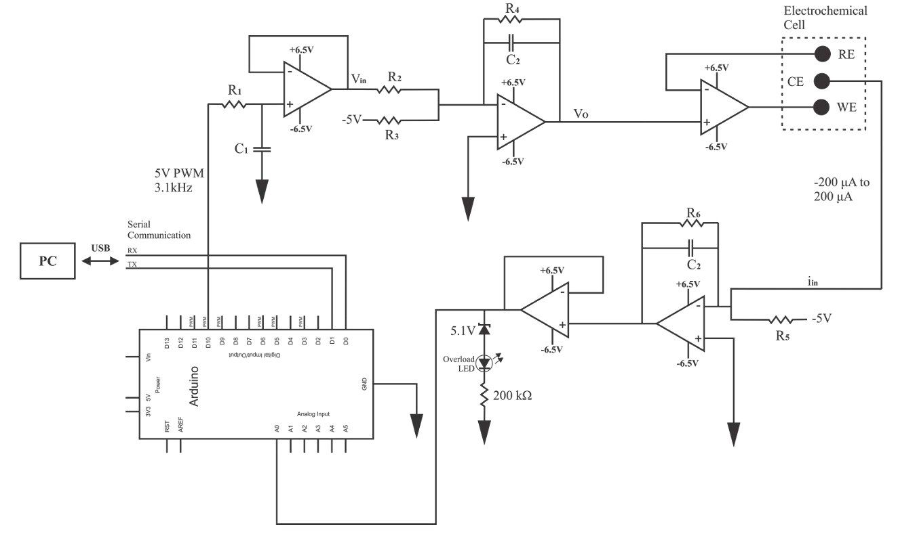
   
   The above is the principle diagram of Meloni's prototype. Next, we analyze the various components of this circuit.
   
   a. Voltage Control Circuit
   
   Op-amps are the core of modern electrochemical workstations. To understand the voltage control circuit, you must first understand op-amps.
   
   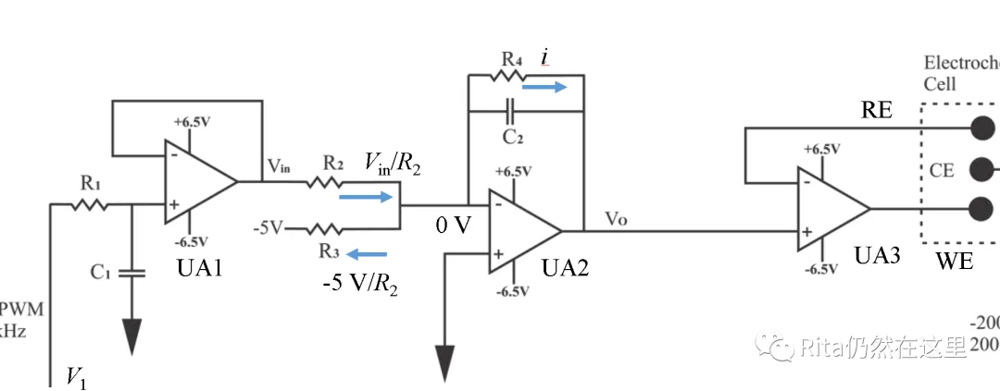
   
   An op-amp has at least five pins: two power supply pins (positive and negative 6.5 V in the figure), a non-inverting input terminal (+), an inverting input terminal (-), and an output terminal. When the output terminal is connected to the inverting input terminal through a resistor, it forms a negative feedback circuit. For an ideal op-amp, the input terminals can be considered as having infinite resistance, and once negative feedback is formed, the potentials of the two input terminals are equal and no current flows through them. Therefore, for the op-amp on the left in the above figure, the output voltage Vin is always equal to the potential of the non-inverting input terminal, which is called a follower and can isolate the circuit. Next, to solve the output potential Vo of the second op-amp, let the current through R4 be i, then Vo = -iR4, it is known that the op-amp has an amplifying effect on the current, and the amplification factor depends on the feedback resistor. Since the current through the inverting input terminal is 0, it is known that i = Vin / R2 - 5 V / R2, and then Vo can be calculated. By controlling Vin = V1, Vo can be controlled; then Vo is connected to UA3, as long as RE and CE are placed in the electrolytic cell, a negative feedback is formed again, and the voltage on RE is equal to V1.
   
   The reason for adopting such a design is that most single-chip microcomputers can only output positive voltage, so a negative voltage bias needs to be applied through R3 to convert it into the voltage range required for cyclic voltammetry. In Meloni's prototype, V1 is supplied by Arduino's PWM. PWM is a technology that generates a square wave by quickly switching the output signal between 0 V and (for Arduino) 5 V. Assuming the duty cycle is a, then the equivalent output voltage is 5 V * a. In order to convert this square wave signal into the direct current signal required for cyclic voltammetry, Meloni's prototype connects a capacitor C1 to the ground between R1 and UA1, thus forming an RC filter circuit. The impedance of the RC filter circuit to the electric signal increases rapidly with the increase of frequency. For signals with a frequency greater than 1/(2pi*RC), the attenuation after passing through the RC filter is greater than 3 dB, which is called the cutoff frequency. The square wave signal can be regarded as a direct current signal superimposed with a series of high-frequency signals after Fourier expansion. Ideally, when the high-frequency signals are fully filtered out, a direct current voltage of 5 V * a can be obtained. Then, after passing through UA1~UA3, it is finally reflected on the potential of RE relative to the ground.
   
   Similarly, the C2 on UA2 also forms an RC filter with R4 to filter out the noise brought by the op-amp as much as possible.
   
   b. Current Sampling Circuit
   
   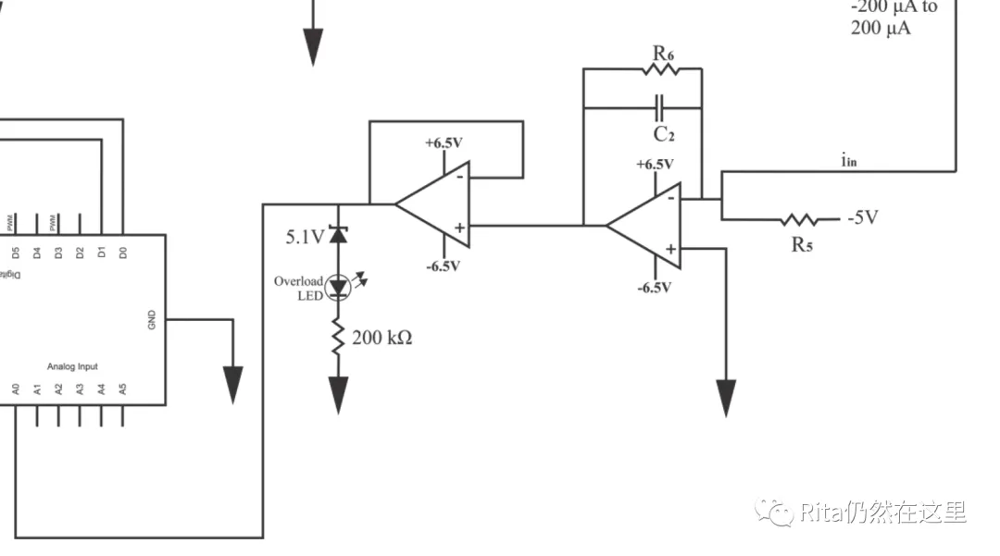
   
   In Meloni's prototype, the current sampling circuit is connected to CE, and a 5 V bias is applied through R5 to the op-amp, and a negative feedback is formed through R6, so that the potential of CE is always 0. The mixed current i is amplified to the potential iR6 (always positive, also because the single-chip microcomputer can only read the positive potential), and after passing through a follower, it enters the ADC pin (Analog to Digital) of Arduino to be read. After reading the above, it is believed that readers have already learned how to calculate the relationship between the current through CE and the ADC reading.
   
   Have you found anything wrong?
   
   In Meloni's prototype, the positions of CE and WE are drawn in reverse. We do not care about the potential of CE, but we must control the potential difference between WE and RE, so WE must be connected to the current sampling circuit, so that the potential of RE relative to the ground controlled above is equal to the negative value of the potential of WE relative to RE.
   
   In summary, now that you have understood the principles of Meloni's prototype, let's begin the implementation.
   
   **3. Material List**
   
   - 1 * Raspberry Pi Pico
   
   - 1 * MCP4725 module
   
   - 1 * ADS1115 module
   
   - 1 * INA219 chip
   
   - 1 * 6 V output DC/DC boost module
   
   - 2 * NE5532 or OP297 op-amps
   
   - 4 * Relay modules
   
   - 1 * CH340 serial port module
   
   - Various capacitors and resistors
     
     The total cost is around 100RMB and everything is easily accessible on Taobao.
     
     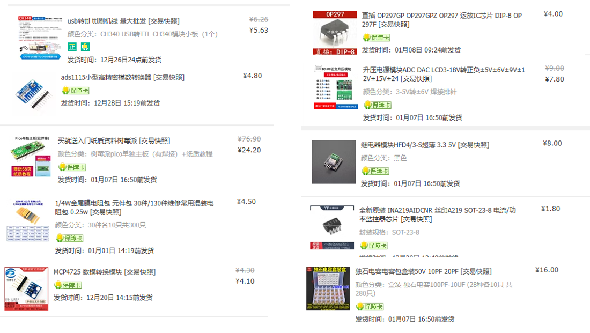
     
     (No Taobao store sponsored this article)
   
   Meloni used Arduino, while this article uses Raspberry Pi Pico. Pico has superior performance and a lower price. It is important to note that Pico's output voltage is 3.3 V (there is also a 5 V pin), so the component values in the circuit based on Arduino's 5 V output need to be recalculated.
   
   **4. Implementation and Failure of Meloni's Prototype, and the First Working Circuit**
   
   Meloni has provided a complete circuit diagram, and implementing it is a simple matter, so it will not be repeated here. The only thing worth mentioning is that the circuit requires a negative voltage, which cannot be achieved with Pico alone. In this article, a boost power module is used to obtain positive and negative 6 V. The positive voltage is very standard, while the actual negative voltage is about -5.5 V. It is also used to power the op-amps. The output voltage of most op-amps is located between the two power supply pins, usually within a relatively narrow range (this will become a consideration for resistor selection in the future), and choosing a rail-to-rail op-amp can output a range close to the supply voltage.
   
   However, it was soon discovered that the foundation of this circuit, that is, the approach of controlling the potential on RE through PWM filtering, is completely unfeasible. On the one hand, even after filtering, the voltage will inevitably fluctuate (ripple phenomenon), and on the other hand, the problem is even more serious:
   
   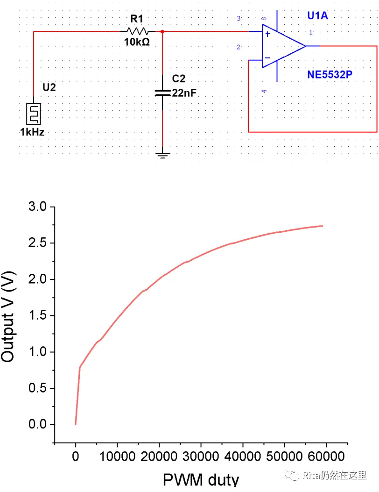
   
   The above figure shows the relationship between PWM duty cycle and the voltage obtained after filtering. Ideally, the voltage should vary linearly with the duty cycle, but the reality is completely different, showing a very irregular curve. In this case, controlling the voltage on RE through PWM is completely unreliable!
   
   Fortunately, due to the high development of modern electronics industry, many functions in the circuit can be conveniently found in modules, and can be handled like building blocks. In fact, if you want to output an adjustable voltage, there is no need to manually design a power supply circuit. You can use the MCP4725 module shown in (3). It is based on the I2C protocol and connects to Pico, and can be conveniently controlled using existing libraries on Github. After testing, it can accurately and stably output 0 ~ 4.5 V direct current voltage.
   
   
   
   After using MCP4725, the above circuit was adopted to adapt to Pico's performance. After building it on a breadboard, it can already be used to determine the CV of ferricyanide in salt water:
   
   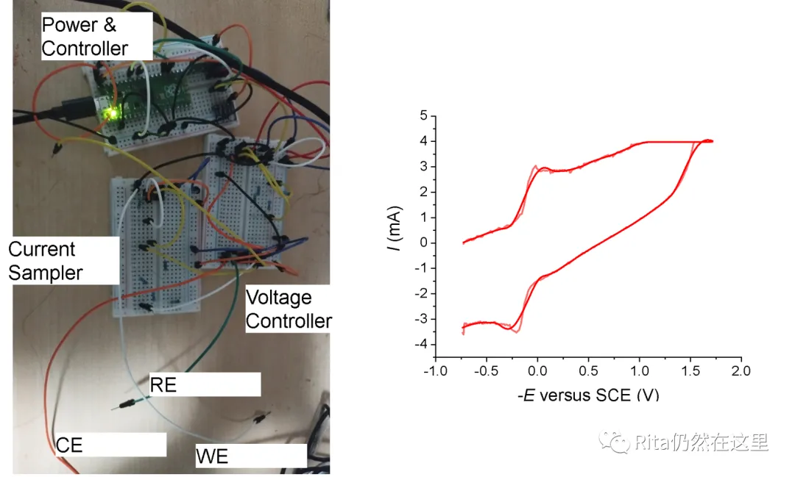
   
   **5. Further Improvement: Redesigning Current Sampling**
   
   The above circuit can be used as a teaching experiment, but there are still many problems if it is to be used for actual measurement. The biggest problem is noise. In fact, the noise of Pico ADC is a worldwide problem, and many people are troubled by it and cannot find a solution. The following randomly shows a measurement result of ADC facing direct current, and it can be seen that there is a considerable degree of irregular jump. This noise completely comes from Pico's own defects and cannot be filtered out by any external circuit.
   
   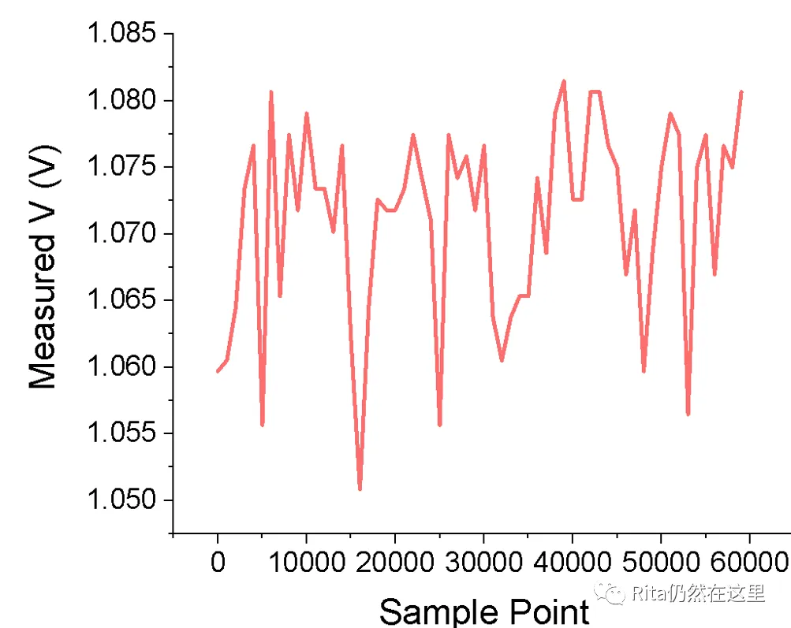
   
   Although the Pico manual gives suggestions to improve ADC, they ultimately did not work, so it is necessary to give up Pico's own ADC and use other modules. Here, two modules are needed: ADS1115 voltage acquisition module and INA219 current acquisition module. Both use the I2C protocol and share 2 wires for communication with MCP4725.
   
   It has been proved that the precision of ADS1115 is good, and it can very smoothly measure the connected voltage, and can measure negative pressure not lower than -0.5 V. But the problem is the sampling frequency. ADS1115 can only sample 860 times per second, which cannot meet the demand of CV test to continuously change voltage and sample in a very short time. If it is forcibly used, it will cause the computer to crash. But it can be used for circuit calibration:
   
   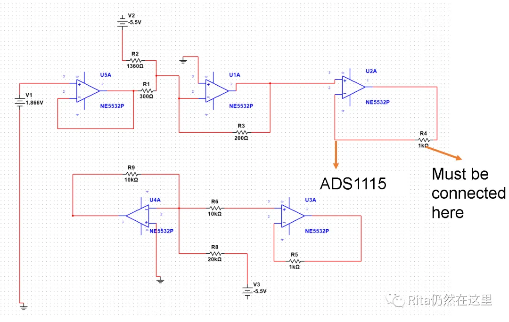
   
   Connect the wiring terminals of RE and CE (this must be done, otherwise negative feedback cannot be formed), and use ADS1115 to measure the voltage at RE, which can calibrate the instrument.
   
   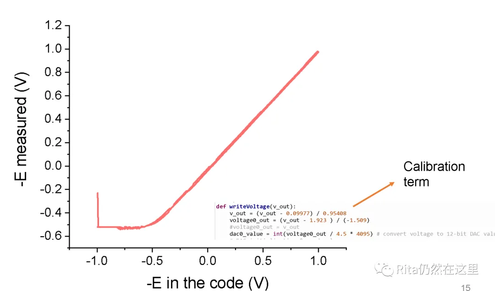
   
   Note that when the voltage is less than -0.5 V, ADS1115 can no longer work normally, and not only does it not work, but it also interferes with others, causing the voltage on RE to be abnormal. Therefore, ADS1115 can only be used for calibration, and it must be disconnected from RE during CV measurement.
   
   The next INA219 will become the core of current sampling. It is different from ADC and directly measures current. INA219 itself is an integrated circuit, which needs to be used with peripheral circuits. The commercially available INA219 modules have already integrated a 0.1 Ohm sampling resistor. It measures the current by measuring the voltage on the sampling resistor, and supports positive and negative currents. The range is adjustable, the minimum range is 400 mA, and the resolution is 12 bits, that is, 400/(2^12)~0.1 mA.
   
   The introduction of INA219 allows us to directly eliminate the cumbersome bias voltage design in the current sampling circuit. We simply need to amplify the current passing through WE to an appropriate range for INA219 to sample. With this approach, we obtained very positive preliminary results after some initial trials. The black line represents the original signal, while the red line shows the result after smoothing.
   
   
   
   The following is the final circuit determined for use by SAKANA:
   
   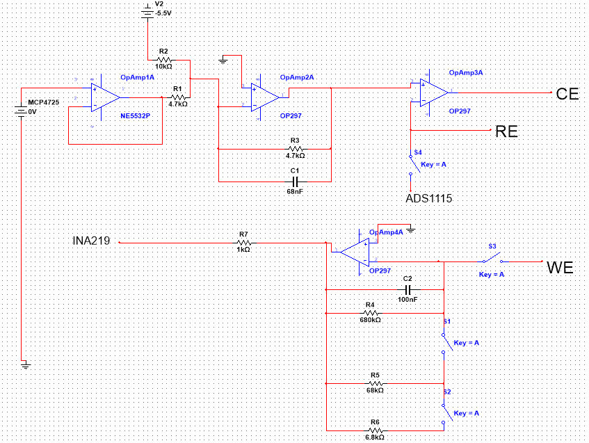
   
   In this circuit, the current i passing through WE is converted into a voltage signal iR through a transimpedance amplifier, where R can be selected between R4 and R6. After passing through R7, the actual current through INA219 is iR/R7, and measuring this current signal allows us to calculate the current passing through RE. To ensure the measurement accuracy of INA219, iR/R7 should not be too small and should be in the range of a few milliamperes; at the same time, iR should not be too large and must fall within the reliable operating voltage range of the op-amp. Since the CV wave current spans three orders of magnitude, from a few hundredths of a microampere to several hundred microamperes, two relays are used to control the connection of resistors between 6.8 k and 680 k to change the range.
   
   OpAmp2 and OpAmp4 have capacitors connected in parallel on their feedback loops, which serve to increase the stability of the op-amps and reduce output noise. With the aid of an oscilloscope, it is clear that C1 plays a crucial role in ensuring the stability of the voltage on RE. Without C1, the voltage on RE would fluctuate by several hundred millivolts, while an appropriately sized C1 can suppress this amplitude to no more than a few tens of millivolts.
   
   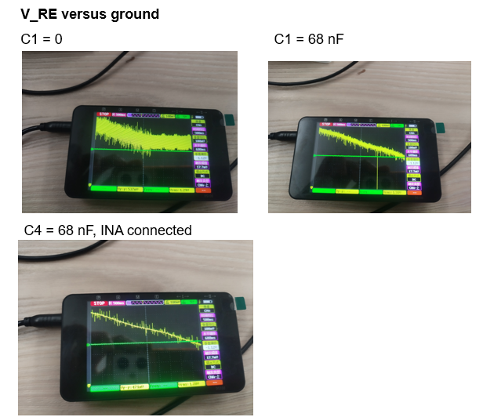
   
   C2 can also significantly suppress noise. After extensive trials, it was determined that C2 should be 100 nF and does not change with the connected resistor. A larger C2 can further smooth the output signal, but it filters out too many rapidly changing signals, leading to waveform distortion and, more seriously, a longer time is required to reach stability when the set output voltage is changed.
   
   R7 is a 1 kOhm resistor. In the early stages of design, a smaller resistor was used at R7, in the hope that it would allow the current through INA219 to be as large as possible to reduce the impact of measurement errors. Unfortunately, a smaller R7 led to unexpected large fluctuations in the measurement curve. The following is a typical graph with R7 = 100 Ohm:
   
   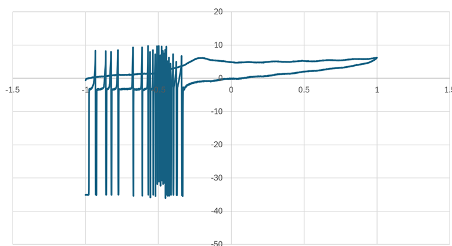
   
   After extensive trials, it was determined that R7 at 1 kOhm would not cause oscillation. To improve the measurement accuracy of INA219 and match the current resistor values, the sampling resistor connected in parallel to it needs to be changed from 0.1 Ohm to 10 Ohm. To achieve this modification, you can either purchase a commercial INA219 module and manually replace the sampling resistor:
   
   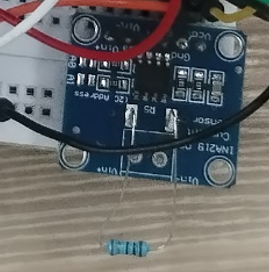
   
   Or you can create your own PCB, and the manufacturing documents have been uploaded in the "Hardware" directory.
   
   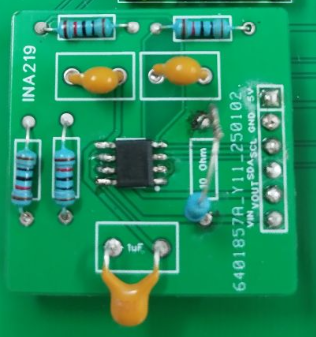
   
   **6. Establishing Connections**
   
   On the breadboard, connect Pico with the various modules using the following wiring diagram (only the connections between modules are shown):
   
   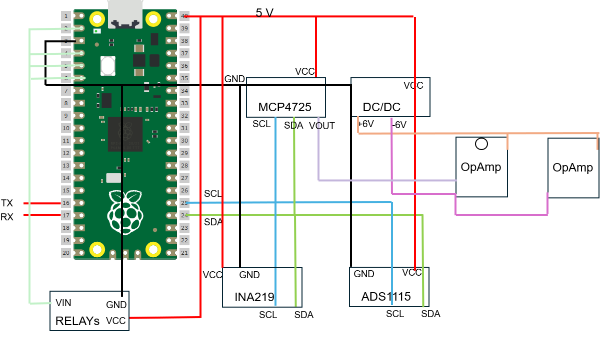
   
   The rest of the connections can be referred to the following schematic diagram:
   
   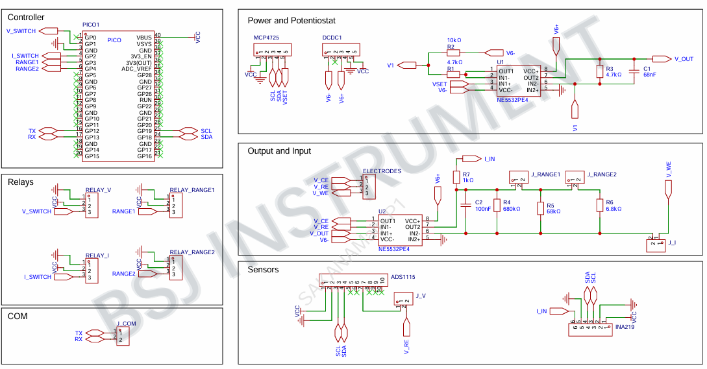
   
   Here, four relays are used, two for controlling the range, one for controlling ADS1115 to connect to RE only when voltage calibration is desired (it must be disconnected during CV measurement, otherwise RE will be abnormal when the voltage is negative), and one for controlling the current sampling circuit (it is only connected during CV measurement, otherwise the electrolytic cell will be continuously electrolyzed). A CH340 serial port module is used to achieve communication with the computer. After the connection is completed, the effect is as follows, and the accompanying software can be used for very convenient debugging.
   
   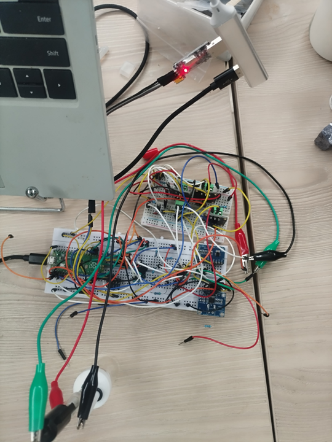
   
   **7. Controlling Software**
   
   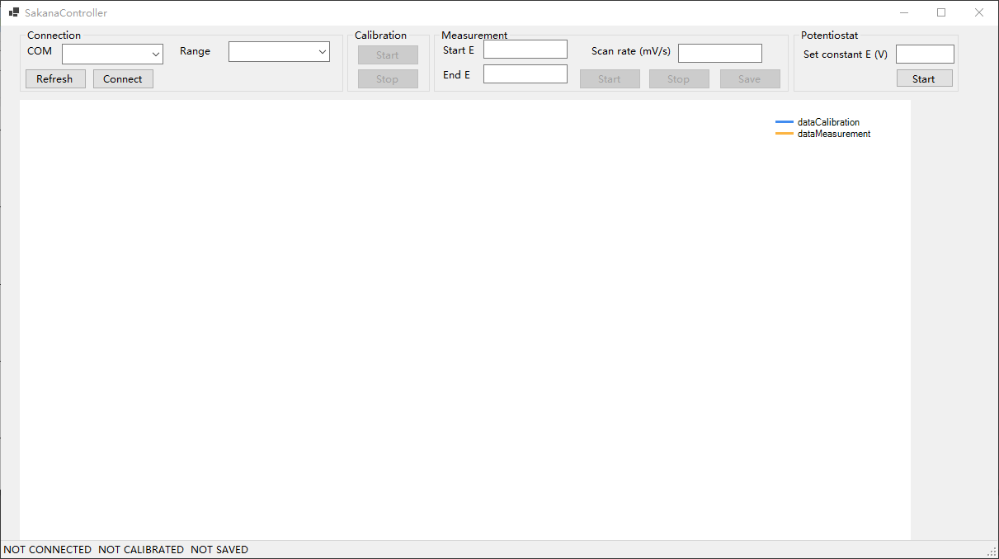
   
   SakanaController is the control program for Sakana. When using it, first find the correct serial port in the Connection area and connect, then click Start in the Calibration area to perform calibration. Under normal circumstances, it should be a downward diagonal line (the jump at the first point is normal and will not bring any impact). The horizontal coordinate here is the output voltage of MCP4725, and the vertical coordinate is the voltage of RE. The linearity between the two is very good, and you can click Stop at any time to stop the calibration in advance. After the calibration is completed, the correlation coefficient between MCP4725 voltage and V_RE will be obtained, which is used for subsequent CV tests.
   
   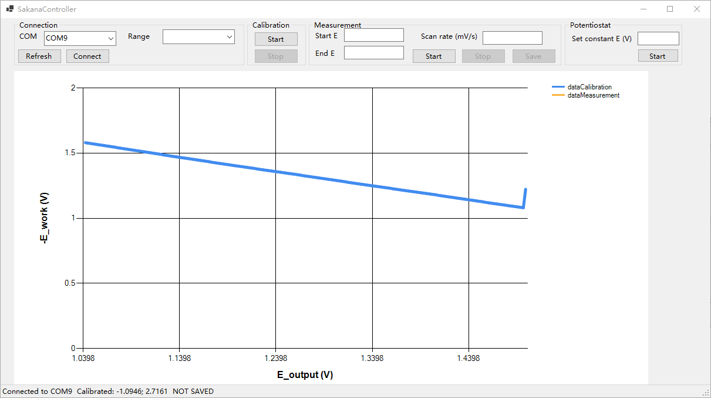
   
   After the calibration is completed, set the test parameters in the Measurement area and click Start to begin the test, and the curve will be updated in real time. The following are some result cases.
   
   *KCl with K4Fe(CN)6*
   
   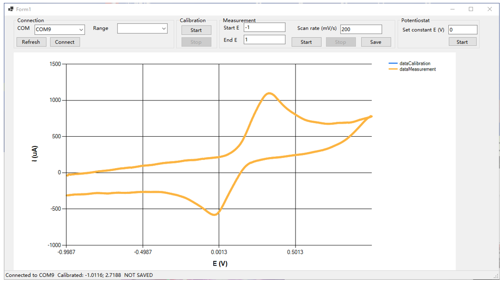
   
   *Ferrocene in DCM*
   
   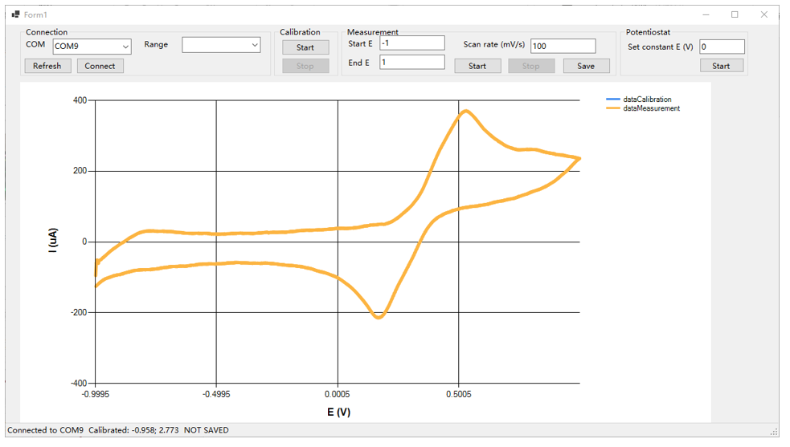
   
   After the test is completed, click Save to save to a plain text file.
   
   In addition to CV measurement, the software also has a potentiostat mode. After the calibration is completed, enter the desired voltage in the Potentiostat and click Start, and the instrument will make the potential of WE relative to RE equal to the set value, which can be used for electrolysis experiments. For instruments soldered onto the PCB, **the voltage range can reach ±2.5 V, with an error of no more than 30 mV (typically 10 mV).**
   
   **8. Transferring to PCB**
   
   Although the circuit built on the breadboard is convenient for debugging, the problem of poor contact is very serious. Just a slight touch can change the performance of the instrument. However, after soldering onto the PCB, a very reliable finished product will be obtained.
   
   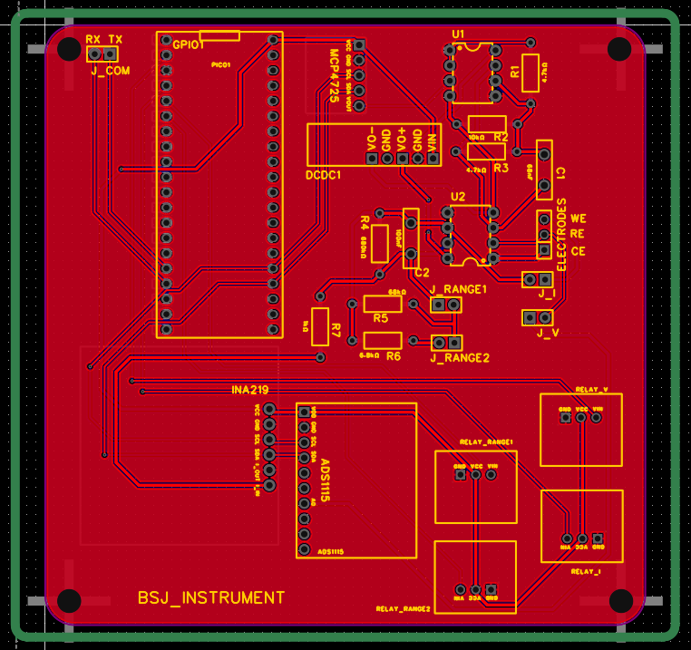
   
   After drawing the schematic and PCB, production and soldering can be carried out.
   
   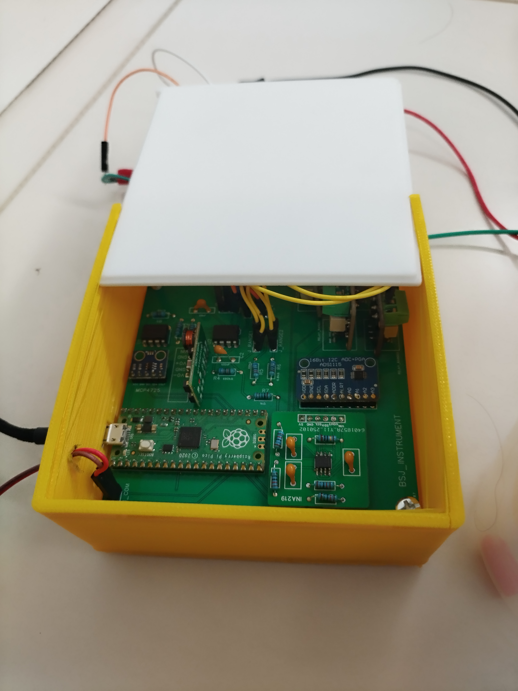
   
   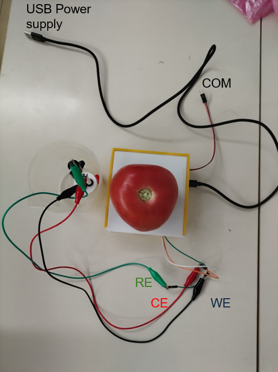
   
   With this, an electrochemical workstation for cyclic voltammetry is completed.
   
   **About**
   
   The name of this project is SAKANA, pronounced similar to "Cyclic."
   
   Readers are highly encouraged to use the content introduced in this article for their own teaching and research. Those who cite this article must indicate the source. **Those who publish or develop secondary projects based on this project must cite the Github page. Commercial use without permission from the author is prohibited.**
   
   *BSJ INSTRUMENT Bozhou Instrument*
   
   January 15, 2025
   
   
   
   This project uses the following achievements from Github repositories:
   
   [chrisb2/pyb_ina219: This library for MicroPython makes it easy to leverage the complex functionality of the Texas Instruments INA219 sensor to measure voltage, current, and power.](https://github.com/chrisb2/pyb_ina219)
   
   [robert-hh/ads1x15: Micropython driver for ADS1115 and ADS1015](https://github.com/robert-hh/ads1x15)

# <a id='Chinese'>SAKANA：年轻人第一台循环伏安的全面制造指南</a>

这是一款基于树莓派Pico的电化学工作站，其中包含了所有软硬件信息。

目录结构：

- Hardware
  
  Gerber_SAKANA_PCB.zip： PCB制板文件
  
  SAKANA_PCB.epro：PCB设计文件（基于立创EDA）
  
  Shell.zip：外壳模型，可进行3D打印

- Sources
  
  SAKANA_Pico.py：Pico上的Micropython文件
  
  SakanaController：上位机控制软件源代码

鉴于绝大多数化学工作者都像我一样，没有接受过系统的电子工程教育，本文中会详细介绍电路的设计过程。如果你有此类基础，可直接跳转到**6. 建立连接**。

1. **背景介绍**
   
   现代电化学工作站基于运算放大器（简称运放）进行设计，主要在20世纪70年代发展起来。早年文献中对电化学工作站的设计原则、特别是电路稳定性问题进行了诸多讨论，这些讨论对电路知识有较高的要求，有兴趣的读者可以自行查阅。近十多年来，得益于单片机技术的普及，使用以Arduino为代表的单片机控制从而低成本制造电化学工作站的案例不断见诸报道，以至于到了相当丰富的程度。甚至已经有学校将自制电化学工作站纳入了分析化学实验课程中（https://www.chem.uci.edu/~unicorn/243/labs/W2019Chem243Lab3.pdf）。
   
   
   
   本文的设计原型来自2016年Meloni的工作（J. Chem. Educ. 2016, 93, 7, 1320–1322）。Meloni报道了基于Arduino的电化学工作站设计，并给出了电路图和简易源代码。然而不幸的是，虽然Meloni文中呈现了良好的结果，但如果直接照搬它的设计，仔细考察，就会发现其实并不能用。接下来我们会展示这一电路的原理、以及本文的装置的设计和改进过程。

**2. Meloni原型机的原理**

   用于循环伏安的电化学工作站基于三电极系统。对三电极系统的理解是仪器分析课程的基本内容，本文不再赘述。一个合格的电化学工作站需要确保以下几点：

   a. 在参比电极(RE)上没有电流流过；

   b. 能精确控制工作电极（WE）相对于RE的电位，并且这一电位需要以最高几个Hz的频率变化；

   c. 能精确测量通过WE的电流，电流的量级在零点几到几百uA之间。

   

a. 电压控制电路  

运放是现代电化学工作站的核心，要理解电压控制电路必须首先理解运放。

一个运放至少有5个引脚：2个电源引脚（图中正负6.5 V），一个同相输入端（图中+），一个反相输入端（图中-），一个输出端。当输出端与反相输入端通过电阻连接时，构成了负反馈电路；对于理想运放，输入端可视为无穷大的电阻，而一旦构成负反馈，则两个输入端电位相等且都没有电流流过。因此对于上图中左侧的运放，输出电压Vin始终等于同相输入端电位，这被称为跟随器，可对电路起到隔离作用。接下来为了解出第二个运放的输出电位Vo，可设通过R4的电流为i，则Vo = -iR4，可知运放对电流有放大作用，放大倍数取决于反馈电阻。由于通过反相输入端的电流为0，可知i = Vin / R2 - 5 V / R2，进而可求出Vo。通过控制Vin = V1，即可控制Vo；随后Vo接到UA3上，只要RE和CE放在电解池中，就再次构成负反馈，RE上的电压即等于V1。  

之所以要采用这样的设计，是由于多数单片机只能输出正电压，因此需要通过R3施加一个负电压偏置来将其转换为循环伏安所需要的电压范围。在Meloni原型机中，V1通过Arduino的PWM供给。PWM是通过让输出信号在0 V和（对于Arduino来说）5 V间快速切换产生方波的技术，假设占空比为a，则等效输出5 V * a的电压。为了将这种方波信号转换为循环伏安所需要的直流信号，Meloni原型机在R1和UA1之间对地接入电容C1，从而构成了RC滤波电路。RC滤波电路对电信号的阻抗随频率上升而快速增加，对于频率大于1/(2pi*RC)的信号，通过RC滤波器后衰减大于3 dB，这被称为截止频率。方波信号经过傅里叶展开后，可视为直流信号叠加一系列高频信号；理想上，当高频信号被充分滤除，就可以得到5 V * a的直流电压。随后经过UA1~UA3，最终反映到RE对地的电位上。

类似地，UA2上的C2同样与R4构成RC滤波器，从而尽可能滤除运放带来的噪声。

b. 电流采样电路

Meloni原型机中，电流采样电路接在CE上，通过R5施加5 V的偏置，接到运放上，通过R6负反馈，使得CE的电位恒为0。两者混合后的电流i被放大为电位iR6（恒为正，同样是由于单片机只能读取正电位），经过一个跟随器后进入Arduino的ADC引脚（Analog to Digital）从而被读取。读完上文后，相信读者已经会计算通过CE的电流与ADC读数的关系了。

你发现了什么不对了吗？

在Meloni原型机中，CE和WE的位置画反了。我们并不关心CE上的电位是多少，而必须控制WE和RE的电位差，因此必须将WE接在电流采集电路处，从而使得上面控制的RE相对于地的电位等同于WE相对于RE的电位的负值。  

总之，现在你已经理解了Meloni原型机的原理，接下来就开始实现吧。

**3. 材料清单**  

- 1 * 树莓派Pico

- 1 * MCP4725模块

- 1 * ADS1115模块

- 1 * INA219芯片

- 1 * 6 V输出DC/DC升压模块

- 2 * NE5532或OP297运放

- 4 * 继电器模块

- 1 * CH340串口模块

- 若干电容电阻
  
  总成本在100元左右。
  
  
  
  （没有任何淘宝店铺赞助本文）

Meloni使用了Arduino，而本文使用树莓派Pico。Pico的性能更为优异，而价格却更加低廉。值得注意的是Pico的输出电压是3.3 V（另有一个5 V引脚），因此基于输出5 V的Arduino的电路中元件取值要重新换算。  

**4. Meloni原型机的实现和失败，与第一版可工作的电路**  

Meloni已经给出了完整的电路图，将其实现是十分简单的事情，不再赘述。唯一值得一提的是，电路中需要使用负电压，仅使用Pico无法做到，本文中使用了升压电源模块得到正负6 V。正电压非常标准，而负电压实际大约为-5.5 V。它同样用于给运放供电。绝大多数运放的输出电压都位于两个电源引脚的电压之间，通常是一个较窄的范围（这将成为日后电阻选值的考量），选择轨到轨运放可以输出到接近供电电压的范围。

然而很快就会发现，这套电路的立足之本，即通过对PWM滤波以控制RE上的电位的做法完全不可行。一方面，即使经过滤波，电压仍然会不可避免地波动（纹波现象），而另一方面的问题则更加严重：

上图展示了PWM占空比与经过滤波得到的电压的关系。理想情况下，电压应随占空比呈现线性，但事实完全不同，呈现出一条十分不规则的曲线。这种情况下，通过PWM控制RE上的电压完全不可靠！  

幸运的是，由于现代电子工业高度发达，许多电路中的功能可以方便地找到模块，像搭积木一样处理。事实上，如果想输出可调的电压，并不需要手动设计电源电路，使用（3）中展示的MCP4725模块即可。它基于I2C协议和Pico连接，可以方便地使用Github上现成的库进行控制。经过实测，它可以精确、稳定地输出0 ~ 4.5 V的直流电压。

使用MCP4725后，采用了如上电路以适配Pico的性能。在面包板上搭建好后，已经可以用于测定盐水中的赤血盐的CV：  

**5. 进一步改进：重做电流采样**  

上述电路如果作为教学实验，则已经可以了；但如果要用于实际测量，还存在诸多问题。其中最大的问题在于噪声。事实上，Pico ADC的噪声是一个世界性难题，许多人都受此困扰而难以找到解决方案。以下随机展示一个ADC面对直流电的测量结果，可见存在相当程度的不规则的跳变。这一噪声完全来自Pico自身的缺陷，无法被任何外部电路滤除。  

尽管Pico手册上给出了改进ADC的建议，但最终它们没能起效，因此接下来需要放弃Pico自带的ADC，采用其他模块。在这里，需要用到两个模块：ADS1115电压采集模块，以及INA219电流采集模块。两者都使用I2C协议，和MCP4725共用2根线进行通信。

事实证明，ADS1115的精度良好，可以非常平稳地测定接入的电压，并且可以测定不低于-0.5 V的负压。但问题在于采样频率，ADS1115每秒只能进行860次采样，无法满足CV测试在很短的时间内连续变化电压并进行采样的需求，如果硬上会造成死机。但它可以用于电路的校准：  

将RE和CE的接线端连起来（必须这样做，否则无法构成负反馈），用ADS1115测量RE处的电压，即可对仪器进行校准。  

注意当电压小于-0.5 V时，ADS1115不再能正常工作，而且不仅自己不干活，还会干扰别人，导致RE上的电压异常，因此ADS1115只能用于校准，CV测量时必须同RE断开。

而接下来的INA219将成为电流采样的核心。它与ADC的思路不同，是直接测量电流。INA219本身是个集成电路，需要搭配外围电路使用，商业可得的INA219模块已经集成了一个0.1 Ohm的采样电阻，它通过测定采样电阻上的电压来给出电流，支持正负电流。量程可调，最小量程为400 mA，分辨率为12位，即400/(2^12)~0.1 mA。  

INA219的引入可以使得我们直接去掉电流采样电路冗杂的偏置电压设计，只要将流过WE的电流放大到合适的范围，让INA219采样即可。利用这种思路，在简单尝试后得到了十分积极的初步结果。其中黑线为原始信号，红线为经过平滑后的结果。

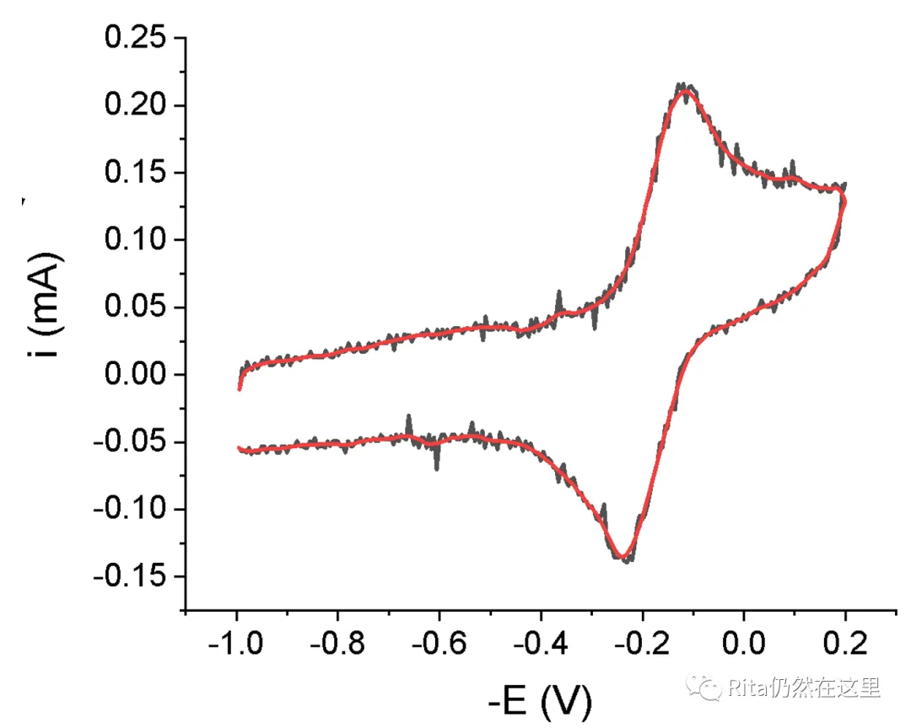

以下为SAKANA最终确定使用的电路：

在这一电路中，流过WE的电流i经过一个跨阻放大器，转化为iR的电压信号，其中R可在R4到R6之间选择。经过R7后，通过INA219的实际电流为iR/R7，测量这一电流信号即可换算为流过RE的电流。为了确保INA219的测量精度，iR/R7不能太小，需要在几个mA量级；同时iR又不能太大，必须落在运放能够可靠工作的电压范围内。由于CV波的电流从零点几到几百uA，跨越了3个数量级，采用两个继电器控制接入从6.8 k到680 k之间的电阻以改变量程。

OpAmp2和OpmAmp4的反馈回路上都并联有电容，起到增加运放稳定性和减少输出噪波的作用。借助示波器，可以清晰地看到C1对于确保RE上电压的稳定性有至关重要的作用。没有C1时，RE上的电压会以几百mV的幅度波动：

C2同样可以显著抑制噪声。此处经过大量尝试，确定C2取值为100 nF，且不随接入的电阻而变化。较大的C2虽然可以进一步使得输出信号变得平滑，但由于滤除了太多快速变化的信号，导致波形畸变、以及更严重的是当改变设定的输出电压时需要相当长的时间才能达到稳定。

R7是一个1 kOhm的电阻。在设计初期，在R7处曾经使用过更小的电阻，寄希望于它能够使得流过INA219的电流尽可能大，以降低测定误差的影响。但不幸的是，较小的R7会导致测定曲线出现未曾预料的巨幅波动。以下是R7 = 100 Ohm的典型图形：

经过大量尝试，确定R7为1 kOhm时，不会出现振荡现象。为了提高INA219的测量精度并与当前电阻的取值匹配，需要将它并联的采样电阻从0.1 Ohm改成10 Ohm。为了实现这一改动，既可以买来商品INA219模块，手动取下采样电阻后更换：

也可以重新做一个自己的PCB，相关设计文件在Hardware里：

**6. 建立连接**

在面包板上，将Pico与各模块连接，采用如下接线图（只标出模块之间的连接）：

其余部分连接可参照如下原理图：

在这里使用了4个继电器，其中2个用于控制量程，1个用于控制ADS1115只在希望进行电压校准时接到RE上（进行CV测定时必须断开，否则RE在负电压时不对），1个用于控制电流采集电路（只在进行CV测定时接上，否则电解池会被持续电解）。采用一个CH340串口模块实现与计算机的通信。连接完成后效果如下，可以使用配套软件非常方便地调试。

**7. 配套软件**

SakanaController是针对Sakana的控制程序。在使用时，首先在Connection区域找到正确的串口并连接，然后在Calibration区域点击Start进行校准。正常情况下，应是一条斜向下的直线（第一个点处存在跳变，属于正常，不会带来任何影响）。此处的横坐标是MCP4725的输出电压，纵坐标为RE的电压，两者线性度非常好，可以在任何时候点击stop提前停止校准。校准完成后，将得到MCP4725电压与V_RE的相关系数，用于后续CV测试。

在完成校准后，在Measurement区域设置测试参数，点击Start，测试就会开始，曲线实时更新。以下为部分结果案例。

*KCl中的黄血盐*

*DCM中的二茂铁*

测试完成后，点击Save，可以保存到纯文本文件。

除了CV测量外，软件还有恒电位仪模式。完成校准后，在Potentiostat处输入期望的电压，点击Start，仪器就会让WE相对于RE的电位等于设置数值，可用于电解实验。对于焊接到PCB上的仪器，**电压范围可达正负2.5 V，误差在30 mV以内（典型值10 mV）**。

**8. 转移到PCB**  

在面包板上建立的电路虽然方便调试，但接触不良的现象非常严重，只要轻微触碰，仪器的表现就会改变，而焊接到PCB板上后就将得到非常可靠的成品。  

绘制好原理图和PCB后，进行生产、焊接即可。

至此，一个用于循环伏安的电化学工作站就完成了。

**关于**

这个项目的名称是SAKANA，发音与Cyclic相似。

非常鼓励读者将本文所介绍的内容用于自己的教学和研究中。凡引用本文者，必须标明出处。**凡进行发表、或基于本项目进行二次开发者，必须引用Github页面。禁止用于未经作者同意的商业用途。**

*BSJ INSTRUMENT 泊州仪器*

2025年1月15日

本项目使用了如下Github仓库中的成果：

[chrisb2/pyb_ina219: This library for MicroPython makes it easy to leverage the complex functionality of the Texas Instruments INA219 sensor to measure voltage, current and power.](https://github.com/chrisb2/pyb_ina219)

[robert-hh/ads1x15: Micropython driver for ADS1115 and ADS1015](https://github.com/robert-hh/ads1x15)
